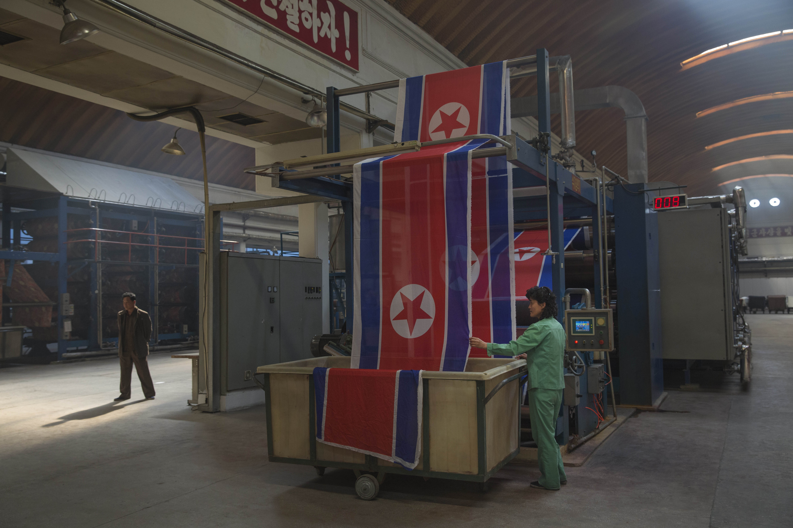

# Guttenfelder Archive Storage Toolkit

### Stanford EE 292J Final Project, Spring 2025

*A trust-preserving storage pipeline for David Guttenfelder's North Korea archive*

By Jay Yu and Ihsaan Doola





## Overview

Within this project, we present a storage toolkit for [David Guttenfelder's North Korea archive](https://www.davidguttenfelder.com/inside-the-cult-of-kim-1), featuring photos taken from 2000-2015 in the Democratic People's Republic of Korea, as well as derived videos and3D reconstructions. Our project seeks to design a storage pipeline for these artifacts using emerging web3 technologies, addressing questions such as:

* What are the different types of data that we need to store from the Guttenfelder archive, and how should we process this data for storage processes?  
* What are the web3 storage technologies that may be available for this task? What are each of their strengths and limitations?  
* How do we use cryptographic techniques to ensure that the data remains secure and tamper-resistant?  
* How do we address privacy issues surrounding what can be revealed to the public, and what must remain confidential to protect journalists and subjects' identities?  
* How does this project compose with existing initiatives by Starling Lab, such as the [Authenticated Attributes project](https://github.com/starlinglab/authenticated-attributes)?

In our proposed solution, we will highlight three key parts in our toolkit solution:

* **1 - Data Input & Processing** - We present a solution to standardize data input from multiple sources, including photos, videos, 3D models, and related metadata, as IPFS-compatible Binary Large Objects (BLOBs), and create prototype for BLOB data sharding. We also take as input signed metadata attestations following the Starling Authenticated Attributes repository.  
    
* **2 - Data Storage Solutions** - We examine various web3 technologies that may be suitable for the storage of various components, including: IPFS via Pinata, Arweave, Data Availability (DA) solutions, Akave's S3-compatible decentralized database solution, on-chain smart contract state (Ethereum Virtual Machine SSTORE), and as Move-language objects on Sui Walrus. We demonstrate a prototype pipeline for BLOB storage on IPFS via Pinata

* **3 - Data Security & Privacy** - We consider a pipeline for data security and privacy of the image data and metadata. We read EXIF metadata, provide a toolkit to store the metadata and related attributes as a Merkle tree, and verification of metadata attributes through the Zero Knowledge Virtual Machine (ZKVM) by Nexus Labs.

## Project Structure

The toolkit is organized into three main parts. All components are implemented in Rust:
```
├── 1-data-input/ # Data input and processing components
│ ├── blob_cid_shard/ # BLOB CID generation and sharding
│ └── starling-attestations/ # Authenticated attributes integration
├── 2-data-storage/ # Storage solution implementations
│ ├── ipfs-pinata/ # IPFS storage via Pinata
│ └── akave-hot-storage/ # Akave S3-compatible storage
├── 3-data-security/ # Security and privacy components
│ ├── rust_exif_merkle/ # EXIF metadata Merkle tree generation
│ └── nexus_zkvm/ # Zero-knowledge verification
└── data/ # Sample photo data
```

## Setup

### Prerequisites
- Rust and Cargo installed

### Required Environment Variables

For storage components, you'll need to set up the following environment variables:

- `PINATA_API_KEY` - API key for Pinata IPFS storage
- `PINATA_SECRET_API_KEY` - Secret API key for Pinata
- `AKAVE_ACCESS_KEY` - Access key for Akave storage (if using)
- `AKAVE_SECRET_KEY` - Secret key for Akave storage (if using)

Create `.env` files in the respective storage component directories:
- `2-data-storage/ipfs-pinata/.env`
- `2-data-storage/akave-hot-storage/.env`

## Usage

#### 1. Data Input & Processing

**Generate CID and shard BLOBs:**
```bash
cd 1-data-input/blob_cid_shard
cargo run -- /path/to/your/image.jpg
```

This will:
- Generate a Content Identifier (CID) for the image/video/3D model
- Shard large files into 256MB chunks
- Output CID information for storage and retrieval to `output` folder

#### 2. Data Storage

**Store to IPFS via Pinata (Cold Storage):**
```bash
cd 2-data-storage/ipfs-pinata
cargo run -- /path/to/your/output/folder
```

**Store to Akave S3-compatible bucket (Hot Storage):**
```bash
cd 2-data-storage/akave-hot-storage
cargo run -- /path/to/your/output/folder
```

#### 3. Data Security & Privacy

**Extract EXIF and create Merkle tree:**
```bash
cd 3-data-security/rust_exif_merkle
cargo run -- /path/to/your/image.jpg
```

**Verify metadata with Nexus ZKVM:**
```bash
cd 3-data-security/nexus_zkvm
cargo run
```

## License

This project is academic work licensed under the MIT License.

## Acknowledgments

- **David Guttenfelder** - For providing the North Korea photo archive
- **Starling Lab** - For the Authenticated Attributes framework
- **Stanford EE 292J** - Course instruction and guidance
- **Nexus Labs** - For ZKVM technology and support
- **Akave** - For S3-compatible storage solution and support